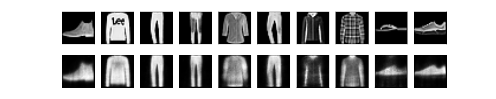
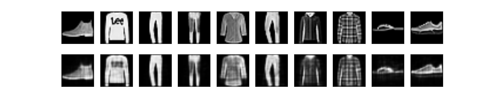

#TCC

Apenas alguns testes.

Treino: MNIST original. Validação: conjunto de testes do MNIST original. Camada oculta 1 de 128 neurônios, 1001 iterações. lossTest = 0.013

Treino: MNIST Fashion. Validação: conjunto de testes do MNIST Fashion. Camada oculta 1 de 128 neurônios, 1001 iterações. lossTest = 0.019

Treino: MNIST Fashion. Validação: conjunto de testes do MNIST Fashion. Camada oculta 1 de 128 neurônios, 10.000 iterações. lossTest = 0.009

