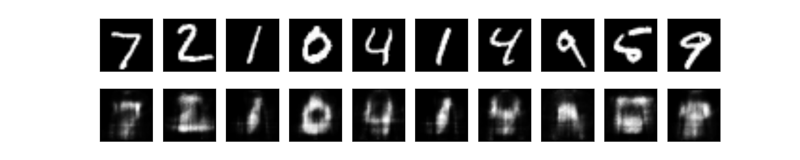
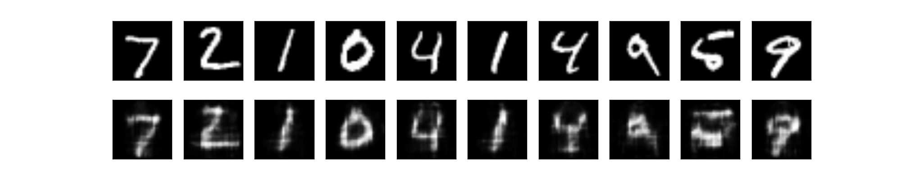
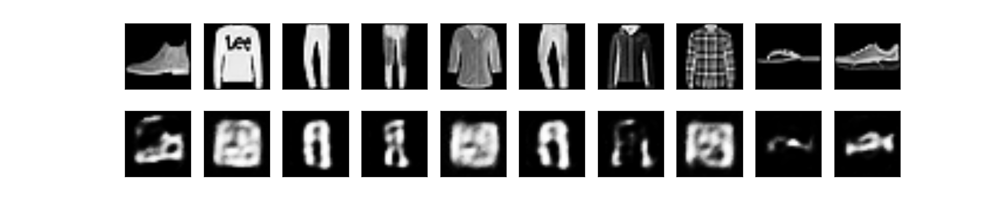
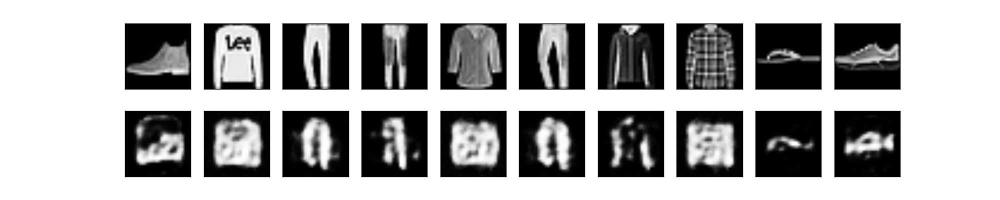
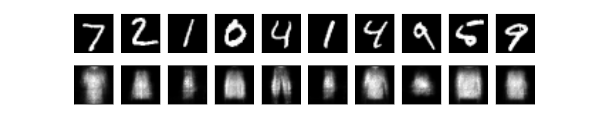
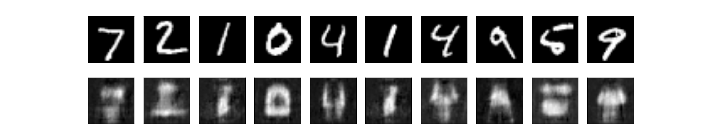
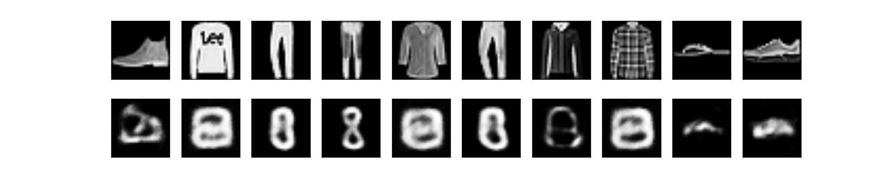
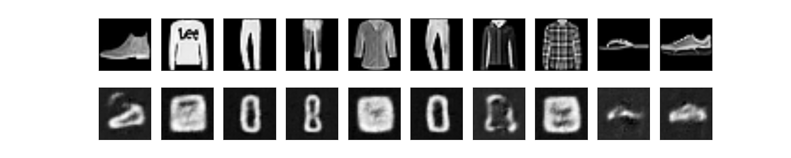

Fashion - MNIST 512 - 256 //    0,009049356	0,034981865	0.94 (+/- 0.04)

Fashion - MNIST 512 - 256 T //  0,007761448	0,026512038	0.94 (+/- 0.03)

MNIST - Fashion 512 - 256 //    0,005273761	0,076310270	0.82 (+/- 0.02)

MNIST - Fashion 512 - 256  T // 0,004140027	0,083749620	 0.82 (+/- 0.02)

Fashion - MNIST 528 - 392 - 256 //      0,014239598	0,059041914	0.80 (+/- 0.06)

Fashion - MNIST 528 - 392 - 256 conv // 0,012984782	0,044060297	0.93 (+/- 0.04)

MNIST - Fashion 528 - 392 - 256 //      0,010790858	0,086304754	0.78 (+/- 0.02)

MNIST - Fashion 528 - 392 - 256 conv // 0,009464751	0,087729920	0.82 (+/- 0.02)

