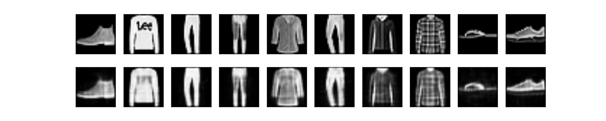
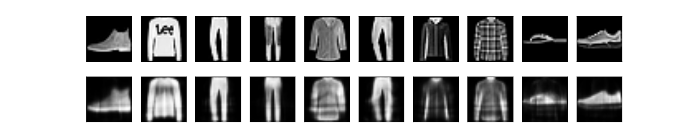
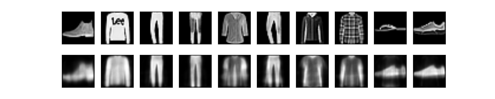

Treino: MNIST Fashion. Validação: conjunto de testes do MNIST Fashion. Camada oculta 1 de **128 neurônios**, 10000 iterações. 

lossTraining = 0.00949. lossTest = 0.01033

Treino: MNIST Fashion. Validação: conjunto de testes do MNIST Fashion. Camada oculta 1 de **64 neurônios**, 10000 iterações. 

lossTraining = 0.01793. lossTest = 0.01559

Treino: MNIST Fashion. Validação: conjunto de testes do MNIST Fashion. Camada oculta 1 de **32 neurônios**, 10000 iterações. 

lossTraining = 0.02435. lossTest = 0.02688

