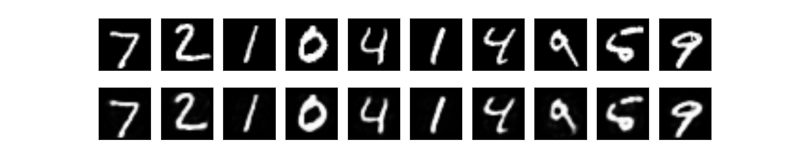
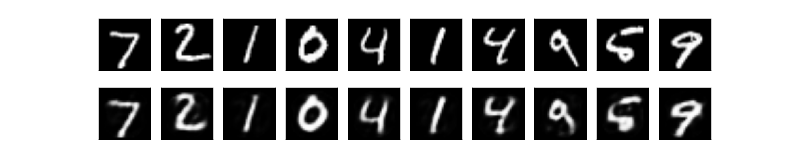
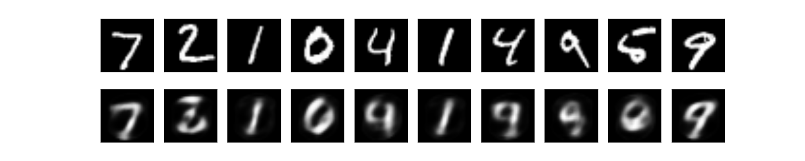

Treino: MNIST. Validação: conjunto de testes do MNIST. Camada oculta 1 de *128 neurônios*, 10000 iterações. lossTraining = 0.00318. lossTest = 0.00348

Treino: MNIST. Validação: conjunto de testes do MNIST. Camada oculta 1 de *64 neurônios*, 10000 iterações. lossTraining = 0.00882. lossTest = 0.00966

Treino: MNIST. Validação: conjunto de testes do MNIST. Camada oculta 1 de *32 neurônios*, 10000 iterações. lossTraining = 0.03632. lossTest = 0.03480

