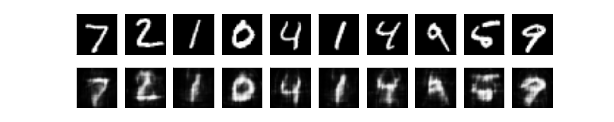
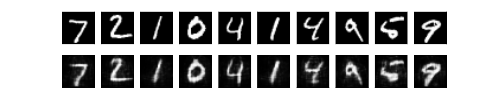
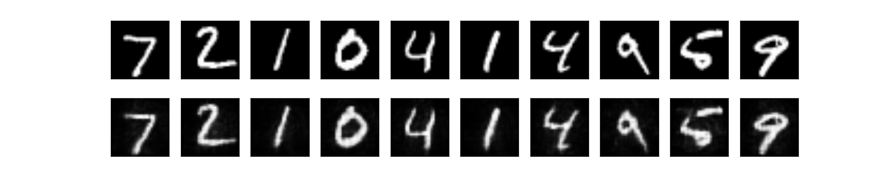

Treino: MNIST Fashion. Validação: conjunto de testes do MNIST original. Camada oculta 1 de **128 neurônios**, 10000 iterações. 

lossTest = 0.02512

Treino: MNIST Fashion. Validação: conjunto de testes do MNIST original. Camada oculta 1 de **256 neurônios**, 10000 iterações. 

lossTest = 0.01242

Treino: MNIST Fashion. Validação: conjunto de testes do MNIST original. Camada oculta 1 de **512 neurônios**, 10000 iterações. 

lossTest = 0.00661

